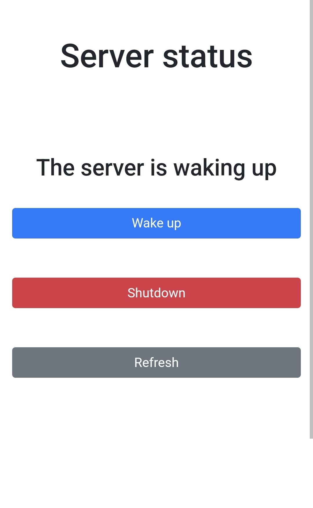

# Overview

This is a proxy server created using NodeMCU (ESP8266) to manage the state of another server.

It hosts a web server that can provide the server status and make changes to it. To wake it up, support for a magic packet on the server is necessary. To shut it down, any web server to manage the shutdown request.

You don't need any other components besides a micro USB cable and a regular 5V plug.

# Steps

1. Download and install the USB driver for your NodeMCU (the older driver is CH340).

2. Install VS Code and the PlatformIO extension.

3. You can either clone this repository or create a new project. Give it a name, select "Espressif ESP8266 ESP-12E" as the board, choose "Arduino" framework, and copy my main.cpp. You may also need to add "lib_deps = ESP8266Ping" in platformio.ini for the ESP8266Ping.h to work.

4. If you haven't already, plug in your NodeMCU and check for it in the Device Manager under the Ports section. Now, back in VS Code, set the port, then press CTRL+ALT+B to build, and after that CTRL+ALT+U to upload it. You're done!
